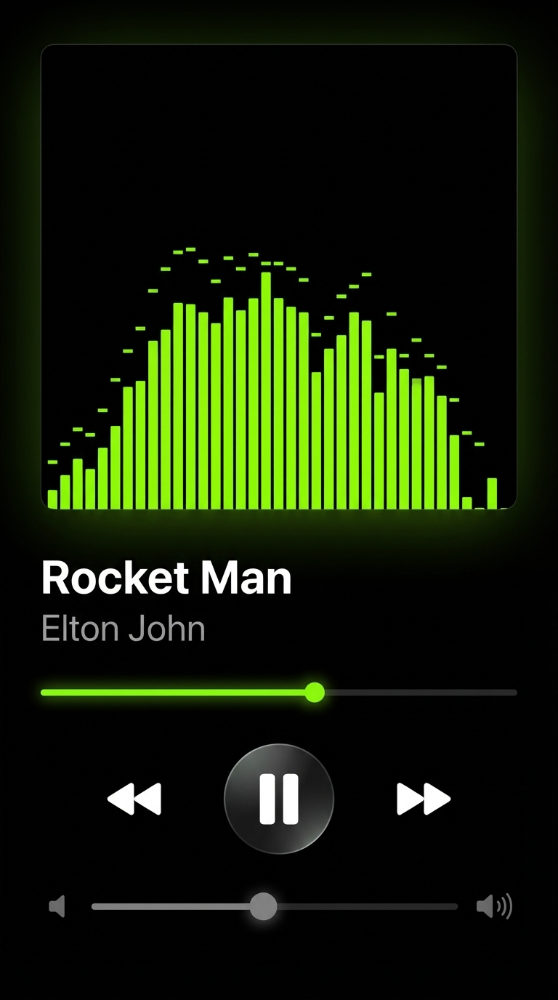

# Music Player



A dark-themed, mobile-first music player built with Vue 3, Quasar, and TypeScript. Plays local files and S3-hosted audio with a real-time visualizer, playlist management, and Media Session API integration.

## Features

### Playback
- Plays MP3, FLAC, OGG, M4A, WAV, AAC files
- Play, pause, seek, previous, next controls
- Loop single track toggle
- Volume control
- Auto-advances through queue when a track ends
- Media Session API integration (lock screen controls, artwork, position state)

### Library
- Add local folders via the File System Access API (no upload needed)
- Add S3 buckets as audio sources (AWS SigV4 pre-signed URLs)
- Background scanner worker reads ID3/Vorbis/MP4 tags (title, artist, album, artwork, duration)
- Falls back to filename when tags are missing
- Search and filter tracks in real time
- Virtual scroll for large libraries
- Artwork thumbnails loaded lazily

### Visualizer
- Real-time frequency bar visualizer using Web Audio API
- Lime-green gradient bars with peak-decay dots
- Offscreen canvas rendering via a dedicated Web Worker (auto-offloads when FPS drops below 30)
- Displayed inside a glowing green card with corner radial highlights

### Now Playing View
- Full-screen dark player on black background
- Visualizer card with glowing green border
- Track title and artist display
- Green glowing seek bar with draggable thumb
- Shiny metallic transport buttons (previous, play/pause, next, loop)
- Volume slider

### Library View
- Dark UI matching the Sonic Noir design
- Search bar, All Songs / Artists / Albums filter tabs
- Numbered track list with artwork, title, artist, duration
- Import button to add new sources
- Mini player bar at the bottom when a track is loaded

### Playlists
- Create and name playlists
- Sort by Recently Added, Alphabetical, or By Artist
- 2-column grid of playlist cards
- Bottom sheet to browse and play tracks from a playlist
- Persisted to localStorage

### Navigation
- Bottom navigation bar: Home, Library, Search, Playlists
- Mini player strip in the bottom nav (artwork, title, prev/play/next) visible on all pages except the player

### PWA
- Service worker registered for offline support

## Tech Stack

- Vue 3 + `<script setup>` + TypeScript
- Quasar Framework v2 (SPA + PWA)
- Pinia for state management
- idb (IndexedDB) for track and artwork storage
- music-metadata-browser for tag parsing
- Web Audio API + OffscreenCanvas Web Worker for the visualizer
- File System Access API for local folder scanning
- AWS SigV4 for S3 pre-signed URL generation (no SDK dependency)

## Getting Started

```bash
npm install
quasar dev
```

Build for production:

```bash
quasar build
```
